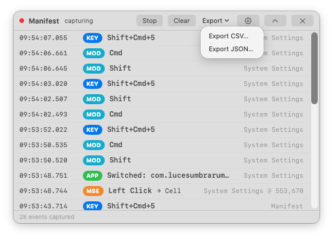
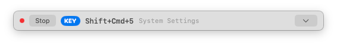
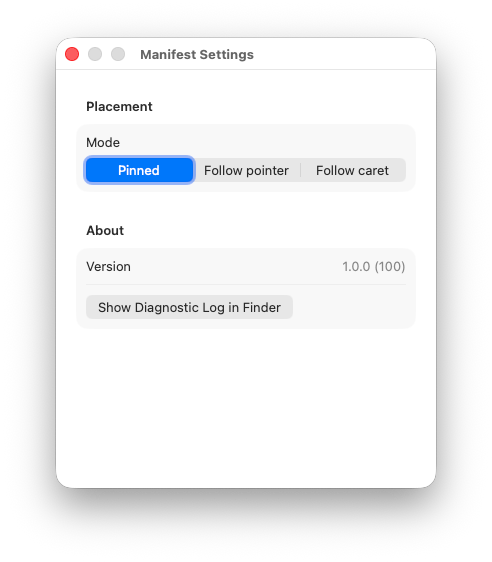
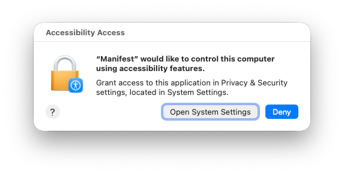

#  Manifest

A floating macOS HUD that surfaces every keyboard, mouse, scroll, and app-switch event as it happens — each tagged with the app that was frontmost at the moment of input and a precise local + UTC timestamp.


[](https://github.com/Xpycode/Manifest/releases/latest)


## Screenshots



*Live capture — every keystroke, click, scroll, and app-switch as it happens, each row stamped with the app that was frontmost and the time. Mouse rows carry the AX role of the element under the cursor (`→ Cell`) and the click point.*



*Compact mode — a slim always-on-top strip showing just the latest event, to stay out of the way during screencasts and demos*



*Settings — placement mode (pinned / follow-pointer / follow-caret), the app version, and a one-click reveal of the diagnostic log*



*First run — Manifest watches system-wide input, so macOS requires Accessibility and Input Monitoring (granted once, persists across rebuilds)*

## Features

- **Four event classes, one stream** — Keystrokes, mouse buttons, scroll/trackpad gestures, and app switches, all interleaved in a single live feed
- **Per-event app attribution** — Every row records the app that was frontmost at the instant of input, so you can see *which* app actually received that ⌘Tab or shortcut
- **Precise dual timestamps** — Local and UTC ISO 8601, captured at tap time
- **Floating, non-activating HUD** — An `NSPanel` at `.floating` level that survives ⌘Tab without ever stealing focus — ideal for screencasts, demos, and debugging
- **Compact mode** — Collapse to a slim strip; the choice (and the panel's position) persists across launches
- **Three placement modes** — Pin it, have it follow the pointer, or follow the text caret as you type
- **Accessibility enrichment** — Mouse clicks are annotated off-main with the AX role and title of the element under the cursor
- **CSV / JSON export** — One click writes the session to disk, with both local and UTC timestamps per row
- **Local-only persistence** — An append-only JSONL log under `~/Library/Application Support/Manifest/`. Nothing leaves your machine.
- **Secure input is dropped at the source** — When macOS marks a field secure (password boxes), keystrokes are discarded at the service layer, never displayed and never written

## Privacy

Manifest reads keyboard and mouse events system-wide while it is running. It is built with a no-egress posture:

| | |
|---|---|
| **Disk** | An append-only JSONL log lives under `~/Library/Application Support/Manifest/`. It contains your keystrokes — it is local-only and never uploaded. Delete the folder to clear it. |
| **Network** | Zero outbound calls. The entitlements file is empty — no networking entitlement, no networking frameworks linked into the binary. |
| **Secure fields** | Password and other `IsSecureEventInputEnabled()` fields are detected and dropped at the service layer — not merely hidden in the UI. |
| **Sandboxing** | Off, because `CGEventTap` requires it. This is a tradeoff inherent to global input capture on macOS. |
| **Diagnostics** | A separate `diagnostic.log` records the app's own *state* (permission status, tap lifecycle) — never event payloads. |
| **Source** | Open. Audit it yourself. |

## Installation

1. Download **`Manifest-1.0.0.dmg`** from [Releases](https://github.com/Xpycode/Manifest/releases/latest)
2. Open the DMG and drag **Manifest** to Applications
3. Launch Manifest from Applications (or Spotlight)
4. On first launch, grant the two required permissions — Manifest shows an in-app banner with a deep link:
   - **Accessibility** — required to install the `CGEventTap` that observes input
   - **Input Monitoring** — required to read raw key codes
   - Toggle **Manifest** on under System Settings → Privacy & Security for each, then relaunch

The HUD has no Dock icon and no menu bar item (it runs as an `.accessory` agent). Quit it with the **×** button on the expanded panel.

## Usage

1. **Launch** — The HUD appears floating above your other windows and starts capturing immediately once permissions are granted.
2. **Use macOS normally** — Type, click, scroll, switch apps. Each event arrives in the panel with its frontmost-app tag and timestamp.
3. **Compact / expand** — Toggle the slim strip for an unobtrusive footprint during a screencast.
4. **Reposition** — Drag the panel anywhere, or switch to follow-pointer / follow-caret placement. Position and mode persist.
5. **Export** — Write the session to CSV or JSON (both local and UTC timestamps per row).

## Requirements

- macOS 15 Sequoia or later (Apple Silicon or Intel)
- Accessibility **and** Input Monitoring permission (one-time grant each)

## Building from Source

Requires Xcode 16+ and macOS 15.0+. The project uses [XcodeGen](https://github.com/yonaskolb/XcodeGen) — install via `brew install xcodegen` if needed.

```bash
git clone https://github.com/Xpycode/Manifest.git
cd Manifest/01_Project
xcodegen generate
xcodebuild -project Manifest.xcodeproj -scheme Manifest -configuration Debug build
```

Run the test suite:

```bash
xcodebuild -project Manifest.xcodeproj -scheme Manifest -destination 'platform=macOS' test
```

The suite covers key labelling, AX-lookup fallback/deadline/cap behavior, panel placement math (flip / clamp / round-trip), and caret tier-transition dedup.

## Architecture

MVVM with a strict-concurrency (Swift 6) capture pipeline:

- **`Models/InputEvent`** — `Sendable` struct, the row primitive (kind, label, bundle ID, point, scroll delta, AX role/title, timestamp)
- **`Services/EventTapService`** — `@MainActor final class` wrapping a `CGEventTap` at `cgSessionEventTap` / listen-only, installed on the main run loop; yields events via an `AsyncStream`
- **`Services/FrontmostAppMonitor`** — Lock-free snapshot of the frontmost app's bundle ID for the C tap callback to read
- **`Services/AXElementLookup`** — Off-main worker that annotates mouse rows with the AX role/title under the cursor, with an aggressive messaging timeout and FIFO cap
- **`Services/CaretFollower` / `PointerFollower` / `PanelPlacementController`** — The three HUD placement modes (pinned / follow-pointer / follow-caret)
- **`Services/EventStore`** — `actor` that appends events to a daily JSONL file
- **`Services/Exporter`** — Pure CSV / JSON serializers
- **`Services/DiagnosticLogger`** — `os.Logger` + a plain-text mirror file for operational state (never event payloads)
- **`ViewModels/EventStreamViewModel`** — `@MainActor @Observable`; consumes the event stream, owns the rolling list, drives export
- **`FloatingPanel` + `Views/`** — Borderless `NSPanel` HUD with SwiftUI-drawn chrome

Full architecture rationale lives in [`CLAUDE.md`](CLAUDE.md) and [`docs/decisions.md`](docs/decisions.md).

## License

GNU General Public License v3.0 — see [LICENSE](LICENSE).

Manifest is copyleft: you are free to use, study, share, and modify it, but any
distributed derivative must also be licensed under the GPL-3.0 and ship its
source. This is a deliberate choice to keep the project and its forks open.
